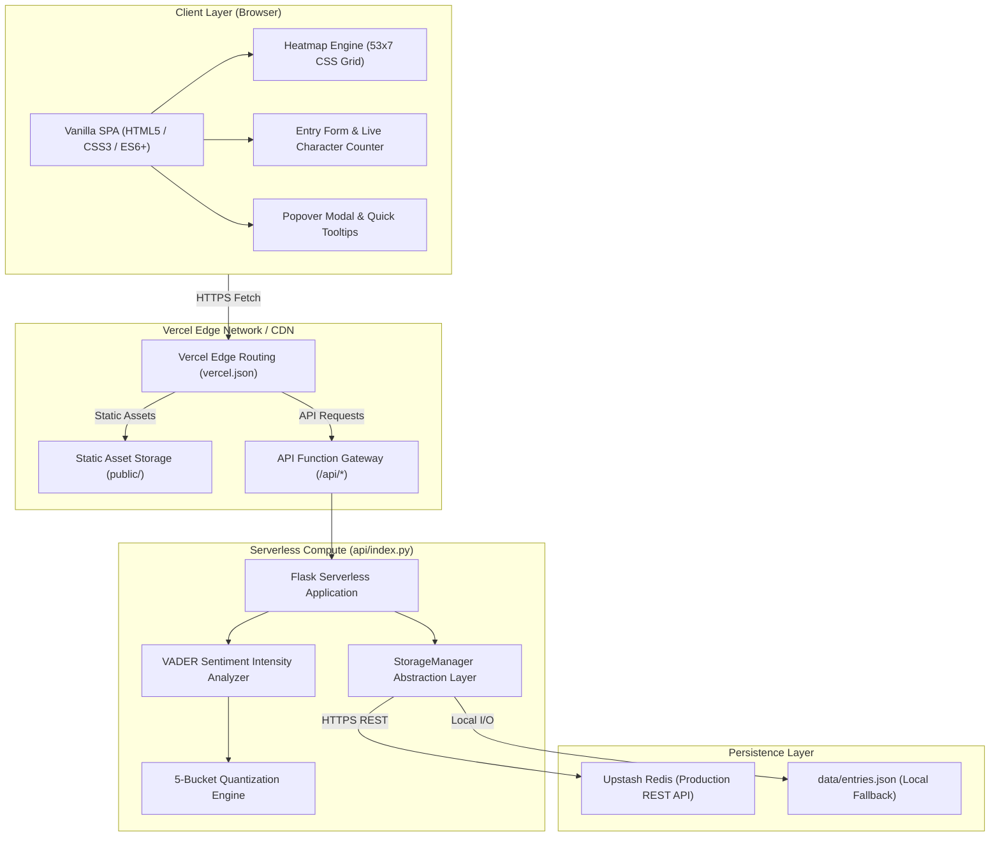

# Mood Journal — Technical Architecture & Design Document

This document describes the internal architecture, design decisions, data models, and performance characteristics of **Mood Journal**.

---

## 🏛 System Architecture Overview

Mood Journal is built as a cloud-native, serverless single-page application (SPA). It pairs a high-performance, framework-free frontend with an ephemeral Python Flask backend hosted on Vercel Functions, backed by an Upstash Redis REST datastore.



---

## 💻 Frontend Architecture (`public/`)

### Design Principles
1. **Zero External Dependencies**: Built entirely with native browser standards (DOM API, CSS Grid, `fetch`). Zero npm packages, zero bundle build steps, zero client-side framework overhead.
2. **Instant First Contentful Paint (FCP)**: Total static asset bundle size is < 50 KB uncompressed (< 15 KB gzip/brotli). Loads virtually instantaneously.
3. **Reactive State Pattern**: A centralized `state` object controls application data:
   ```javascript
   const state = {
     entriesMap: new Map(), // dateStr -> { score, bucket, text? }
     currentStreak: 0,
     longestStreak: 0,
     totalEntries: 0,
     todayStr: 'YYYY-MM-DD',
     selectedDate: null,
     isSubmitting: false,
   };
   ```

### 53×7 Heatmap Rendering Engine
The heatmap is a GitHub-style calendar matrix constructed via native CSS Grid:
- **Geometry**: 53 columns × 7 rows = 371 cells.
- **Orientation**: `grid-auto-flow: column;` ensures that indices fill top-to-bottom (Sunday through Saturday) before advancing to the next column.
- **Boundary Math**:
  ```javascript
  // End date is aligned to Saturday of the current week
  const gridEndDate = new Date(today);
  gridEndDate.setDate(today.getDate() + (6 - currentDayOfWeek));

  // Start date is exactly 371 days prior
  const gridStartDate = new Date(gridEndDate);
  gridStartDate.setDate(gridEndDate.getDate() - (53 * 7 - 1));
  ```
- **Month Labels**: Column indices where a new calendar month begins are detected dynamically and mapped to the header grid.

---

## ⚙️ Backend Architecture (`api/index.py`)

### Serverless Execution Model
On Vercel, requests to `/api/(.*)` trigger the `@vercel/python` serverless runner:
- Each serverless invocation can be ephemeral and stateless.
- In-memory global state cannot be assumed to persist between requests.
- Traditional TCP connection pools (like standard Redis client sockets) can suffer from timeout or connection-exhaustion issues during rapid scaling.
- Therefore, Mood Journal uses **HTTP/REST-based Upstash Redis** for persistence.

### Sentiment Analysis: Why VADER over TextBlob?
While early drafts considered TextBlob, the technical design explicitly selected **VADER (`vaderSentiment`)** for key architectural advantages:

| Factor | TextBlob | VADER (`vaderSentiment`) |
|---|---|---|
| **Serverless Cold Starts** | Requires NLTK corpora (`punkt`, `averaged_perceptron_tagger`) | **Zero external downloads** (pure Python, self-contained) |
| **Deployment Footprint** | Large NLTK dependency tree (~100 MB) | **Lightweight (< 1 MB)** |
| **Punctuation / Casing Awareness** | Naive lexicon, ignores `!` and `ALL CAPS` | **Specifically tuned for punctuation, capitalization, and emojis** |
| **Polarity Compound Range** | Continuous [-1.0, 1.0] | Continuous [-1.0, 1.0] |

#### VADER Scoring Formula
The normalized compound score is computed as:
$$x = \sum \text{valence scores of words in lexicon}$$
$$\text{Compound Score} = \frac{x}{\sqrt{x^2 + \alpha}}$$
where $\alpha \approx 15$ is a default normalization constant.

---

## 🗄 Storage Abstraction Layer (`StorageManager`)

To allow seamless development both locally (offline) and in production (cloud), `StorageManager` implements a dual-mode strategy:

```python
class StorageManager:
    def __init__(self):
        self.redis_url = os.environ.get('UPSTASH_REDIS_REST_URL')
        self.redis_token = os.environ.get('UPSTASH_REDIS_REST_TOKEN')
        self.use_redis = bool(self.redis_url and self.redis_token)
        # Automatic fallback to local JSON if credentials are unset
```

### Redis Schema
Data is stored within a single Redis Hash (`entries`):
- **Key**: `entries`
- **Field**: `YYYY-MM-DD` (ISO calendar date)
- **Value**: Serialized JSON string:
  ```json
  {
    "date": "2026-09-12",
    "text": "Had an amazing, cheerful, and successful day!",
    "score": 0.88,
    "bucket": "very_positive",
    "created_at": "2026-09-12T07:15:00Z",
    "updated_at": "2026-09-12T07:15:00Z"
  }
  ```

### Benefits of Redis Hash
1. **O(1) Single-Date Lookup**: Fetching an individual day's journal entry via `hget('entries', '2026-09-12')` executes in $\mathcal{O}(1)$ time.
2. **Atomic In-Place Update**: Submitting twice in the same day updates the hash field in place without data duplication.
3. **Lightweight Heatmap Listing**: `GET /api/entries` reads all dates via `hgetall('entries')`, extracts only `{ date, score, bucket }`, and returns a lightweight payload without sending large text blobs.

---

## 🔢 Streak Calculation Algorithm

The streak calculation runs in $\mathcal{O}(N \log N)$ where $N \le 371$:
1. Parse all valid `YYYY-MM-DD` keys from entries into Python `datetime.date` objects.
2. **Current Streak**:
   - Check if $D_{\text{today}}$ exists. If yes, traverse backwards day-by-day ($D - 1, D - 2, \dots$) until a missing day is encountered.
   - If $D_{\text{today}}$ is missing, check if $D_{\text{yesterday}}$ exists. If yes, traverse backwards from yesterday.
   - Otherwise, current streak is 0.
3. **Longest Streak**:
   - Sort unique dates chronologically.
   - Iterate linearly through the sorted list, incrementing a consecutive counter whenever $D_i = D_{i-1} + 1\text{ day}$.
   - Maintain the maximum window observed.

---

## 🔒 Security & Quality Assurance

- **Input Validation**: Text is stripped and validated strictly to $1 \le \text{length} \le 1000$. Payloads violating constraints are rejected with `400 Bad Request`.
- **Date Format Sanitization**: Dates must conform to regex `^\d{4}-\d{2}-\d{2}$`.
- **Content-Security & XSS Prevention**: All text rendered into the DOM is escaped or injected via safe DOM properties (`textContent`), preventing Cross-Site Scripting (XSS).
- **Environment Isolation**: Sensitive Upstash Redis API tokens are kept strictly in server-side environment variables and are never leaked to the client.
